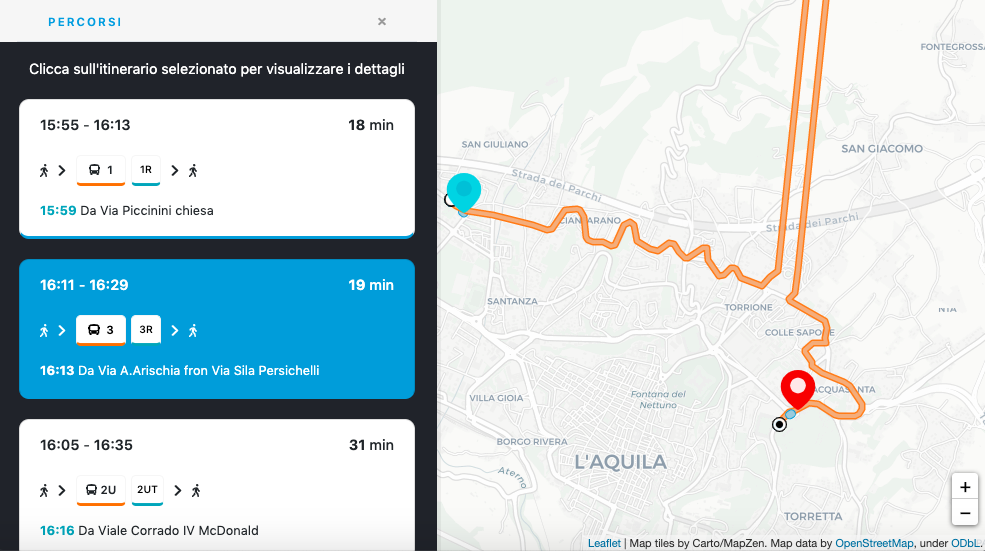
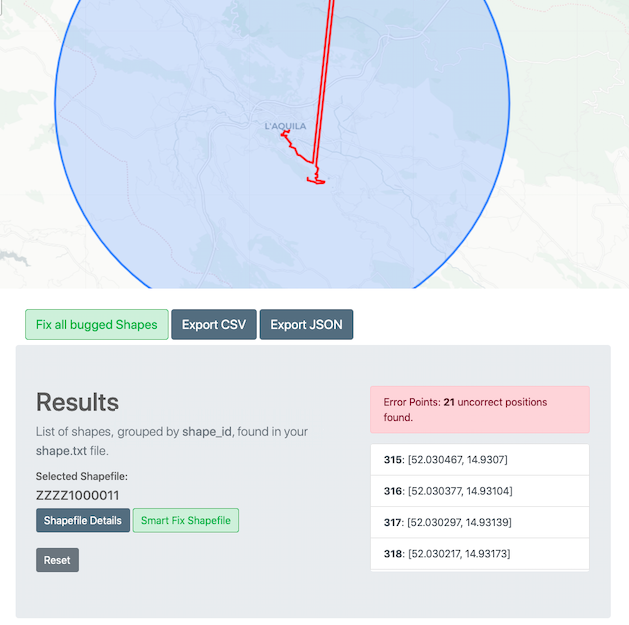

# GTFS Shapes Validator
Shapes describe the path that a vehicle travels along a route alignment, and are defined in the file shapes.txt. Shapes are associated with Trips, and consist of a sequence of points through which the vehicle passes in order. [Google GTFS Shape Reference](https://developers.google.com/transit/gtfs/reference#shapestxt)

**GTFS Shapes Validator** is a web tool to check shape points of paths in your GTFS and fix shape errors as you can see below.
>#### Have you ever seen strage shapes like this in your application?

### So start validating your GTFS [here](https://giuseppebianchi.github.io/gtfs-shapes-validator/).

## Validate and fix shapes of your GTFS

It uses the in-browser CSV parser [Papaparse](https://www.papaparse.com/) to read the content of shape.txt file, in your GTFS.

Once the CSV is validated, Shapes Validator detects any shape point that is not contained in the central area, built with center and radius values.

## Usage

>* Import the **shape.txt** file from your unzipped GTFS file.
>* Set a fixed point on map, which will be the center of all shapes.
>* Set the max distance from center to build an area that should contain all shape points.

## Results
GTFS Shapes Validator will return all shapes found in shapes.txt, as a list, grouped by **shape_id** value, and it allows you to:
>* show details of any shape
>* show invalid shape points on map
>* fix a single shape
>* correct auto-fixed shapes with a nice UI, just by dragging shape points on map where they should be
>* export new shapes as **CSV**, to replace shapes.txt in your GTFS file, or **JSON**

## Contributing
Pull requests are welcome. For major changes, please open an issue first to discuss what you would like to change.

## License
[MIT](https://choosealicense.com/licenses/mit/)

Copyright (c) 2020 Giuseppe Bianchi
